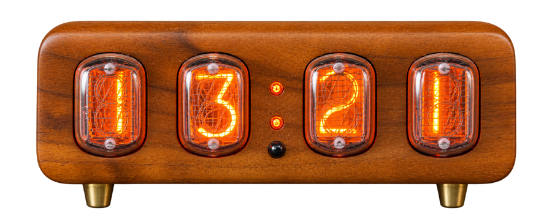

# Guoran Clock

A Windows desktop controller for XGGF Bluetooth LE nixie clocks, developed with an IN12_M4 clock with four IN-12 tubes. It replaces the basic controls of the older Guoran Android application with a desktop interface.

<p align="center"></p>

**[Download the latest Windows release](https://github.com/Sallaxer/guoran-clock/releases/latest)** · **[User guide](docs/USER_GUIDE.md)** · **[Bluetooth protocol](docs/PROTOCOL.md)**

## Features

- Bluetooth LE discovery, connection and settings readback.
- Backlight color, available controller channels and remote-control buttons.
- Time synchronization, two alarms and an on/off schedule.
- A menu reference beside the remote, opened automatically by SET.
- English and Russian interfaces, light and dark themes.
- Local preferences and exportable diagnostic logs; no cloud service.

## Requirements

- Windows 10 or 11 with a working Bluetooth LE adapter.
- Microsoft Edge WebView2 Runtime.
- A compatible XGGF clock. Compatibility with every model or firmware is not established.

The packaged executable does not require a separate Python installation. **Only Windows builds are currently provided and tested.** macOS and Linux support would require platform-specific changes and hardware testing; the current application explicitly uses the Windows WebView2 backend and Windows Bluetooth radio API.

## Quick start

1. Download `GuoranClock-2.3.1-windows-x64.zip` from Releases and extract it to a writable folder.
2. Power on the clock, enable Bluetooth on the computer and run `GuoranClock-2.3.1.exe`.
3. Choose **Connect clock → Find clock**. Select a device whose name starts with **XGGF**.
4. Enter the clock's current six-digit password. The original app's default is **210709**. Click **Connect**.
5. Select **English** in the sidebar if needed. Choose a backlight color and click **Apply color**.

Close another app's clock connection before connecting from this application. Read the [user guide](docs/USER_GUIDE.md) for SET/OK navigation, schedules and tube protection.

## Understanding device feedback

**Clock reply** means the value came from a settings response. **Sent, not confirmed** means Bluetooth accepted the write, but the clock has not confirmed that setting in a new response. A successful Bluetooth write alone does not prove that the firmware applied it.

Some firmware returns unusual sensor values or invalid schedule times. Those fields remain unknown without hiding other settings. Read settings requests a new snapshot and may reconnect if the clock does not reply. The snapshot is not a live view of the clock's menu or current time.

SET sends **Back → 250 ms pause → SET**, based on observed behavior of the tested clock. This sequence is covered by automated transport tests; its physical effect still needs confirmation. Uncertain sensor functions are identified in the interface rather than given an invented meaning.

## Build from source

Use Windows and Python 3.13 x64:

```powershell
python -m venv .venv
.venv/Scripts/python.exe -m pip install -r requirements.txt
.venv/Scripts/python.exe -m unittest discover -s tests -v
.venv/Scripts/python.exe guoran_desktop.py
./scripts/build.ps1 -Python "$PWD/.venv/Scripts/python.exe"
```

The build script runs the tests and creates `releases/GuoranClock-2.3.1.exe`. The Windows package includes Python and application dependencies. The system WebView2 runtime is still required.

## Project layout

| Path | Purpose |
| --- | --- |
| `guoran_desktop.py` | Window API, application state and preferences |
| `bluetooth_backend.py` | BLE worker, authentication, writes and notifications |
| `protocol.py` | Command formatting and response parsing |
| `localization.py` | Backend status translations |
| `ui/` | HTML/CSS/JavaScript interface and clock artwork |
| `tests/` | Protocol, transport, state and command-sequence tests |
| `scripts/build.ps1` | Windows build script |
| `docs/` | User guide, protocol and release notes |

Preferences are stored in `%LOCALAPPDATA%/GuoranClock/preferences.json`. The connection password is not saved there. Exported logs are written beside the executable and may contain nearby Bluetooth device names and addresses; review them before attaching them to a public issue.

The protocol was studied from the original Android app. This is an independent project, not an official manufacturer release. The repository does not include the APK, original manual scans, warranty documents or private diagnostic logs. Clock artwork was generated by editing a photograph supplied by the project owner.
